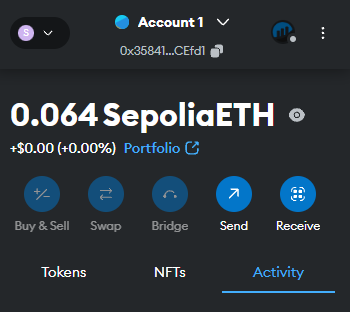
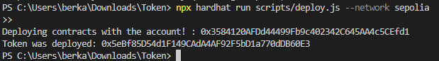
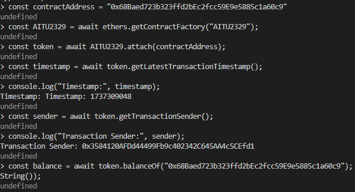

# BT3 Project - Blockchain-Based Financial System

This repository contains the BT3 project, which focuses on blockchain-based financial solutions utilizing ERC-20 token functionalities. The project demonstrates smart contract implementation on the Sepolia testnet and includes additional utilities for tracking and managing transaction details.

## Table of Contents

- [Project Overview](#project-overview)
- [Key Features](#key-features)
- [Prerequisites](#prerequisites)
- [Installation](#installation)
- [Usage](#usage)
- [Examples](#examples)
- [License](#license)

## Project Overview

The BT3 project involves the creation of an ERC-20-compliant token with enhanced features for monitoring transactions on the blockchain. This project serves as a demonstration for token deployment, smart contract functions, and blockchain integration using development tools like Hardhat and MetaMask.

## Key Features

- **ERC-20 Compliance:** Implements standard token functions such as `transfer`, `balanceOf`, and `approve`.
- **Initial Token Supply:** Mints 7700 tokens to the deployer's address upon contract deployment.
- **Advanced Transaction Tracking:** 
  - Access block timestamps in a readable format for the latest transactions.
  - Retrieve sender and receiver addresses for specific transactions.

## Prerequisites

Ensure the following dependencies are installed before starting:

- [Node.js](https://nodejs.org/) v16 or higher
- [Hardhat](https://hardhat.org/)
- [MetaMask](https://metamask.io/)
- [Sepolia testnet ETH](https://cloud.google.com/application/web3/faucet/ethereum/sepolia/)
- [QuickNode](https://www.quicknode.com/)

## Installation

1. Clone the repository:

   ```sh
   git clone https://github.com/Kuvernoori/BT3.git
   cd BT3
   ```

2. Install dependencies:

   ```sh
   npm install
   ```

3. Set up environment variables:
   
    Create a `.env` file in the root directory and add the following:
    ```
      url: process.env.QUICKNODE_URL,
      accounts: [process.env.PRIVATE_KEY],
    ```
    

## Usage

### Compile the Contract

```sh
npx hardhat compile
```

### Deploy the Contract to Sepolia

```sh
npx hardhat run scripts/deploy.js --network sepolia
```



### Interact with the Contract

Start the Hardhat console and attach to the deployed contract:

```sh
npx hardhat console --network sepolia
```

```javascript
const contractAddress = "0xYourContractAddress";
const AITU2329 = await ethers.getContractFactory("AITU2329");
const token = await AITU2329.attach(contractAddress);
```

#### Example Interactions

- **Get the latest transaction timestamp:**
  ```javascript
  const timestamp = await token.getLatestTransactionTimestamp();
  console.log("Latest Transaction Timestamp:", timestamp);
  ```

- **Retrieve transaction sender:**
  ```javascript
  const sender = await token.getTransactionSender();
  console.log("Transaction Sender:", sender);
  ```

- **Retrieve transaction receiver:**
  ```javascript
  const receiver = await token.getTransactionReceiver("0xReceiverAddress");
  console.log("Transaction Receiver:", receiver);
  ```
  
  

## Examples

### Deploying the Contract

```sh
npx hardhat run scripts/deploy.js --network sepolia
```

### Checking Token Balance

```javascript
const balance = await token.balanceOf("0xYourWalletAddress");
console.log("Token Balance:", balance.toString());
```

## License

This project is licensed under the MIT License. See the [LICENSE](LICENSE) file for details.
